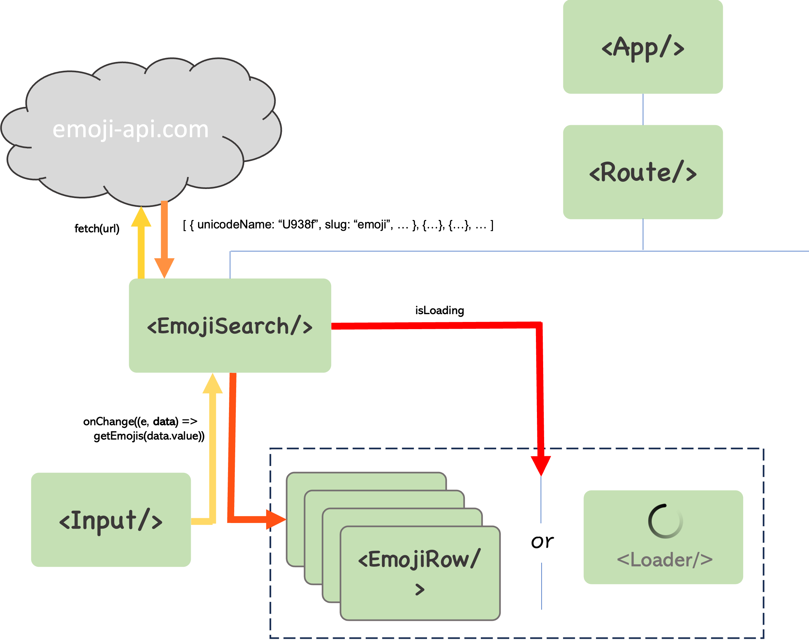

# The big picture

:::tip
"What makes a good programmer is how they think about the bigger picture and pay attention to breaking changes and how to rollback." - my former mentor
:::

### What does the big picture of our emoji app look like?

Realising this architecture is not step one, at least for me. We should have an idea of what the design of our application will look like just as we're starting to implement the app, but this will likely evolve and improve as the granular details of our implementation become clearer, (or as the business requirements evolve over time). We need to constantly **refactor** our implementation to reflect revised architectures, **_and we (at least I) only have clarity of this final architecture just prior to the final refactor_**.

Ultimately, as you spend more time working on React applications, how _you_ reach the "big picture" will become clearer to you.

#### How did we refactor our demo app?

- We initially placed all our UI JSX to show 1 emoji row directly inside `App`, when we wanted to just get the application up and running. First, we refactored this UI into the `EmojiRow` component.

Subseqently, our `App` component consisted of several `EmojiRow`s and the Input components. Our second refactor was to group `Input` and `EmojiRow`s inside a new `EmojiSearch` component. This added semantic meaning by separating the responsibility of `App` and `EmojiSearch`. This also gave us a clean enough architecture to integrate `Routes` into `App` in exercise 3.

### Examples of how we used key development concepts of React in our demo?

#### 1. Modularisation

`EmojiRow` formed into a modular component, that we then used with the Javascript `.map()` method to re-instantiate multiple times for all emojis

#### 2. Declarative vs Imperative

`EmojiRow` was re-instantiated for each emoji that the endpoint returned. We didn't have to keep track of how many rows we needed to create in HTML every time we changed the input. We just _declared_ what the row should look like, and React handled the rest for every emoji the server returned.

#### 3. Component re-usability

We were able to reuse `EmojiRow` and `List` multiple times. Even `Loader` and `Placeholder` that we imported from `semantic-ui`, are modular re-usable components that we can "plug-and-play" anywhere in our app/

#### 4. Component hierarchy

This allows us to separate concerns of functionality.

- We were able to abstract away logic to route to different components by wrapping our search and details pages inside `<Routes/>`.
- We carried out all the external data fetching in `EmojiSearch`, and passed the data to `EmojiRow`.

#### 5. Flow of information

