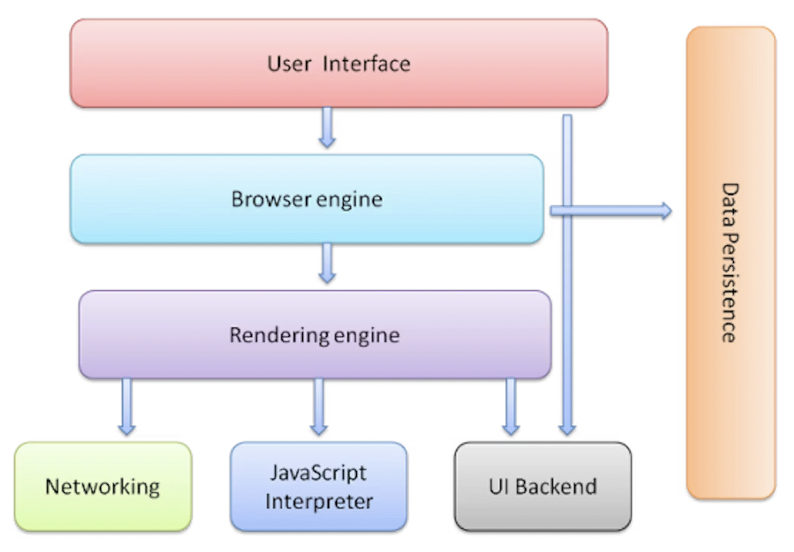

# How browsers work

- **User interface:** The browser's GUI including address bar, forward/back buttons, bookmarks list, zoom tool etc. This does _not_ include the webpage that the browser is rendering.
- **Browser engine:** Relays actions and information between the GUI and rendering engine.
- **Rendering engine:** Parses HTML and CSS to build a DOM, and displays this content on the webpage.

## Document Object Model (DOM)

:::tip
Open browser devtools by right-clicking on web page > inspect

Or,

`cmd + shift + c`
:::

> Further resources
>
> - [How browsers work](https://web.dev/howbrowserswork)
> - [Introduction to the DOM](https://developer.mozilla.org/en-US/docs/Web/API/Document_Object_Model/Introduction)
