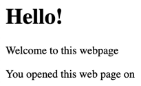

# HTML, CSS and JS

### How browsers work

[howBrowsersWork](./assets/howBrowsersWork.png)

- _User interface:_ The browser's GUI including address bar, forward/back buttons, bookmarks list, zoom tool etc. This does _not_ include the webpage that the browser is rendering.
- _Browser engine:_ Relays actions and information between the GUI and rendering engine.
- _Rendering engine:_ Parses HTML and CSS to build a DOM, and displays this content on the webpage.

### HTML (Hypertext Markup Language)

HTML defines the structure of a webpage using a sequence of user-written tags. Every tag has an opening and closing syntax.

```
<html lang="en">

<head>
  <meta charset="UTF-8" />
</head>

<body>
  <div id="container">
    <h1>Hello world!</h1>
    <p class="text">You opened this page on</p>
  </div>
</body>
```



### CSS (Cascading Style Sheets)

#### Adding styles to the content

```
#container {
  padding: 20px;
  margin: 30px;
  height: 100%;
  font-size: 20px;
  border: 1px solid black;
  border-radius: 5px;
  width: fit-content;
}

h1 {
  color: maroon;
}

.text {
  margin: 20px 0;
  color: blue;
}

.shaded {
  font-size: 16px;
  color: darkBlue;
  background: #e7e7e7;
  padding: 5px;
}
```

> Further resources
>
> - [https://internetingishard.netlify.app/html-and-css/index.html](https://internetingishard.netlify.app/html-and-css/index.html)


### Javascript

#### Adding logic using vanilla JS

We want to:

- Add the current time to the content
- Display how many seconds have elapsed since the start of the current minute

```
// 1. Find the present time
const currentTime = new Date();

// 2. Find element in DOM and change its text content
var paragraphs = document.querySelectorAll("p");
var timeParagraph = paragraphs[0];
timeParagraph.textContent =
  timeParagraph.textContent + " " + currentTime.toLocaleString();

// 3. Add a new paragraph to tell us the seconds in the current minute.
var p = document.createElement("p");
p.textContent = `What are the odds of it being exactly ${currentTime.toLocaleTimeString()}!`;
p.className = "shaded";

var container = document.getElementById("container");
container.appendChild(p);
```

#### See it in action

```
https://codepen.io/grvshrm/pen/eYPoPzw
```

<iframe
  src="https://codepen.io/grvshrm/embed/eYPoPzw"
  style={{ width: '100%', height: '400px' }}
></iframe>

### What are the issues here?

1. This is an _imperative_ approach to writing software. Our Javascript code is tightly coupled to the HTML elements, and we have to explicitly define which unique HTML element we want to change.
2. This coupling resuls in unintended changes that break our application. For example, if we add a new HTML tag to the top of the page, our current webpage would break, because `timeParagraph` would no longer be the `0th` element in the `paragraphs` array.
3. How do we unit test this?
4. How can we modularise a unit bit of functionality? There will be a lot of code replication as the application grows bigger.
5. Imperative implementations are verbose because DOM manipulations are a rather long-drawn process.

> Further resources
>
> - [How browsers work](https://web.dev/howbrowserswork)
> - [Javascript tutorial - Codecademy](https://www.codecademy.com/learn/introduction-to-javascript)
