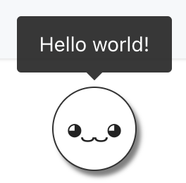

# Concept

If you did the previous exercises, in what order did you develop the components? And why did you decide to take that particular sequence of development?

If you started by building the container list of emojis first, followed by
each individual row of emoji details, CDD suggests we do it the opposite way
round.

### What is component-driven development?

Frontend applications are becoming increasingly expansive and
complex; the CDD approach helps with the development and management
of such complicated codebases by facilitating healthy development practices.

Fundamentally, CDD dictates that the most granular components should be
developed first, followed by their parent composite components, followed by
their parent higher-order components. In doing so, the functionality of the
smallest components must first be identified and

### How is it beneficial?

1. Forces us to develop components in isolation, which makes them more
   reusable. Sometimes you might find 2-3 components built for specific use
   cases that resemble and do very similar things, either because they were
   left undiscovered or were tightly coupled for their use-case. CDD enables us
   to use a single, flexible component as far as possible from the onset.
   

     

       
     

     

       
     

   

2. Keeps components small and focused, and encourages component composition.
   Such components are easier to maintain.
3. Encourage passing data to UI components via `props`. Further, it
   helps identify optional props and set default values for them. This enhances
   reusability and the definition of a _default state_.
4. Localise styles for components. Styles should only live where the
   component lies instead of a parent component (unless the parent is
   explicitly responsible for setting for instance the layout of its child
   component).
5. Keeps naming generic where possible.
6. Adds a good layer of quality assurance. Building a component in isolation
   provides an opportunity to individually test the component using automated
   tests. Further, visual and behavioral requirements can be reviewed by the
   relevant stakeholders. Receiving feedback early in the development phase
   saves time.
7. Ecourages use of the _Render Props Pattern_ for a slots-based API to
   increase component flexibility.

In summary, CDD ensures we have components that are **maintainable**,
**modular**, **flexible** and **resuable**.

In the next section, we look at tools that we can use for CDD in a React
application.
