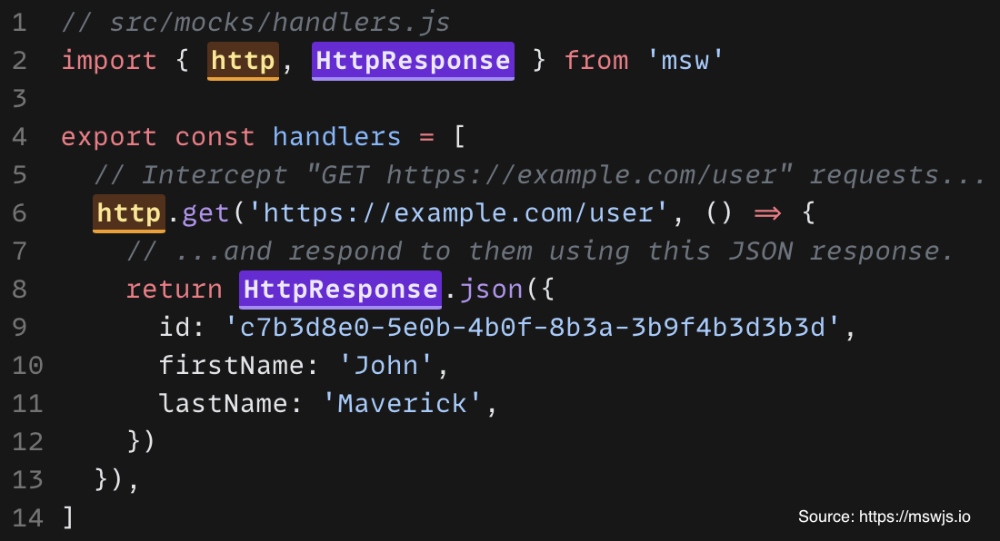

# Storybook

React storybook is a useful package for developing both fundamental and
composite components in isolation. We will explore component-driven
development with storybook by means of an example.

## Setting up a new project with storybook

#### Setting up a new Vite project

We will be using `vite` as the project bundler. In a suitable
development directory, run:

```bash
npm create vite@latest
```

In the setup menu, give the project a meaningful name, eg. "react-storybook".
The default is "vite-project". Next, select `React` as the framework, and
`typescript + swc` as the language and transpiler. These options will give
you the most performant configuration.

Next, `cd` into the newly created folder and run the following to install the
bundling dependencies:

```bash
npm install
```

#### Installing React Storybook

Finally, run the following command to install storybook:

```bash
npx storybook@latest init
```

#### Running Storybook

Storybook should have started on its own on port 6006. If not, run the
following command to start storybook:

```bash
npm run storybook
```

## Exercise

We will be building a simple to-do list in Storybook:


## Extra: the complete page with storybook

Modern development involves pages consisting of multiple other composite
components, several endpoint requests, user interactivity, dynamic ui based
on api responses, errors and responsiveness (screen sizes) among others.
Storybook provides ways in which we can cater to each of these. Among the
most used are as follows.

#### Mocking api requests

- Requests can be intercepted and mocked using Mock Service Worker:
  

More information can be found here: `https://mswjs.io/docs/getting-started`.

#### Responsiveness

#### Interactivity

#### Creating documentation
