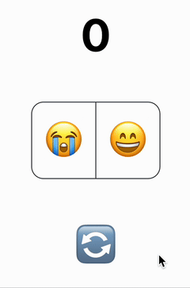

# #1: Count my emoji

counter

Clone the following repo:

[https://github.com/gforce-sh/ubs-smu-demo](https://github.com/gforce-sh/ubs-smu-demo)

We are going to work on the `main` branch (a sample react app is setup on the `react-app-template` branch).

In this lab, we will learn how to update and reset a simple counter by 1.

> Useful links:
>
> - [CSS](https://developer.mozilla.org/en-US/docs/Web/CSS)
> - [styled-components](https://styled-components.com/docs/api#styled)
