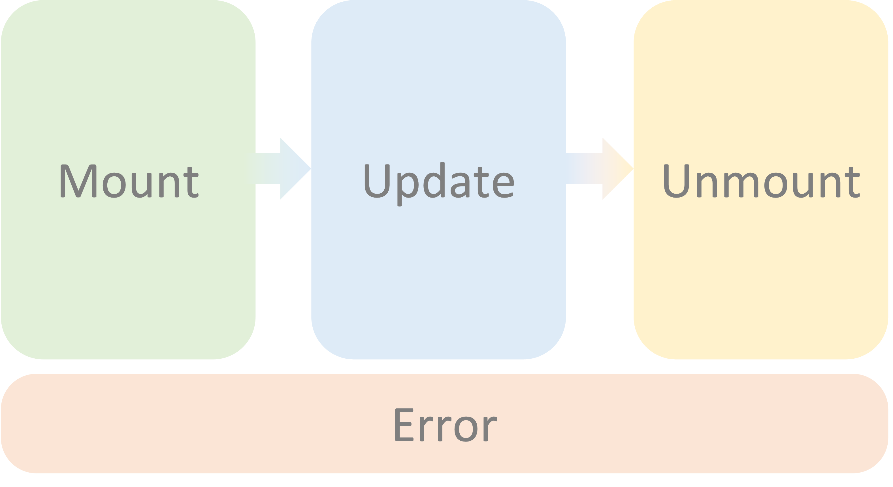

# Composition, Data management and Event lifecycle

### 2. React Components

React lets us split UI into independent, reusable pieces called 'Components`, so that we can think about each piece in isolation and test each component in isolation.

```
const App = () => {
  return <p>Hello React</p>;
};
```

[(See on Codepen)](https://codepen.io/grvshrm/pen/ZEmBYLp)

A react component is simply the declaration of a component as above. In this case, it's a **_Functional component_**, but can be a **_Class component_** too. **A functional component is declared as a JavaScript function which returns JSX**.

### 3. React Element

Components can be composed of other components. This is what makes React modular. In order to render a component inside another component, we place the child component name inside _angular brackets_ this way:

```
const Greeting = () => {
  return <p>Hello React</p>;
};

const App = () => {
  return <Greeting />;
};
```

React elements are real Javascript objects, and beneath the syntactic sugar, React is just calling`React.createElement()` to create a new React element.

### 4. Props

Props enables components to exchange information between each other. 'Props' is the name give by react to an object that a parent component will always pass its child component. We can pass individual pieces of data to a child component as keys of the Prop object.

In the example above, `text` is one such defined prop, who's value is set to 'Hello React' and is passed down from the `App` component to the `Greeting` component. `Greeting` could be re-written as:

```
const Greeting = ({ text }) => {
  return <p>{text}</p>;
};

const App = () => {
  return <Greeting text={"Hello React"} />;
};
```

:::info
When writing the `Greeting` component above, we are destructuring the props object. Destructuring is a Javascript syntactic sugar. The component can we re-written as:

```
    const Greeting = (props) => {
        const text = props.text;
        return <p>{text}</p>;
    }
```

:::

### 5. State

A React application would typically need to maintain some state information. For example, if you are booking a transport on a ride-hailing service, the application would need to store the following information in state before it calls an API to make a booking:

- Customer's name and id
- Current location
- Destination
- Type of transport request (4-seater, premium, van etc)

In React, a state is a simple JS object, that can be stored internally in a component, whose value is persisted across re-renders.

- A state should be private to the component it is created in.
- If we violate this principle of encapsulation, we end up with tighly coupled code that is hard to interpret, change and extend. **We don't want to do this**.

Using React hooks, we can create a state in a component as follows:

```
import { useState } from 'react'

const App = () => {
    const [state, setState] = useState("");

    return (
        <div>
            <button onClick={() => setState("Hello React")}>Click me to set state!</button>
            <p>{state}</p>
        </div>
    );
};
```

We'll see it in action in the demo later.

### 6. Rendering a virtual DOM

A React application is composed of such components and elements. React reads these components and formulates a 'virtual DOM', that it then attaches to one DOM node specified by our single line of HTML. This attachment is done as follows:

HTML

```
    <div id="root"></div>
```

JSX

```
    ReactDOM.render(
        <App />,
        document.getElementById('root')
    );
```

:::info

#### React is a Single Page Application

The virtual DOM that we construct using JSX written in React components attaches to a single HTML element (`div` with `id=root`). This happens whenever we load a new component to the page. This means that whenever we change a route on a React application, say from `hello.com` to `hello.com/learn/react`, the browser only makes it _look like_ the page has been changed. In reality, we're on the same HTML `div` element, just that a new virtual DOM has been attached to it.
:::

### 7. Event Lifecycle

There are 4 main stages in the life of a page.



React provides us with a function (actually a `hook`) to carry out actions for each of these events.

#### Mounting

```
  import { useEffect, useState } from 'react';

  const App = () => {
    const [state, setState] = useState("");

    useEffect(() => {
      setState("Hello React")
    }, [])

    return (
        <div>
            <p>{state}</p>
        </div>
    );
};
```

#### Updating (or re-rendering)

```
  import { useEffect, useState } from 'react';

  const App = ({ sayHello }) => {
    const [state, setState] = useState("");

    useEffect(() => {
      if(sayHello) {
        setState("Hello React");
      } else {
        setState("")
      }
    }, [sayHello])

    return (
        <div>
            <p>{state}</p>
        </div>
    );
};
```

#### Unmounting

```
 import { useEffect, useState } from 'react';

  const App = () => {
    const [state, setState] = useState("Hello React");

    useEffect(() => {
      return () => {
        setState("")
      }
    }, [])

    return (
        <div>
            <p>{state}</p>
        </div>
    );
  };
```

#### Error

Currently, if we want to catch an error inside a React component, instead of using a functional component, need to write a stateful component and use the `getDerivedStateFromError` method. This is not a common occurence, as most errors arise in Javascript functions and are handling using `try-catch` blocks, or their equivalent. Therefore it is not very important right now, and we will look at `getDerivedStateFromError` in stateful components later if we are able to finish the the exercises in time.

:::tip
Generally, the entire nest of React components is wrapped in one stateful component with `getDerivedStateFromError` to catch any JSX-based errors.
:::

### 8. React Hooks

Hooks let us access state, add actions to lifecycle events, memoise expensive computations in components among a wide variety of other features. `useState`, `useEffect`, `useMemo`, `useCallback` are all hooks provided out-of-the-box with react. We will see these hooks in action in the exercises next. You can read more about available hooks [here](https://legacy.reactjs.org/docs/hooks-intro.html).

We can define our own custom hooks to. Hooks are a great way to modularise _logic_ (as opposed to UI, which is modularised with the help of react components) between componenets. For example, I can write a custom hook to fetch weather data, and then re-use the hook by calling it in every React component on every page where the weather data is required. See [Reusing Logic with Custom Hooks](https://react.dev/learn/reusing-logic-with-custom-hooks) for more details.
